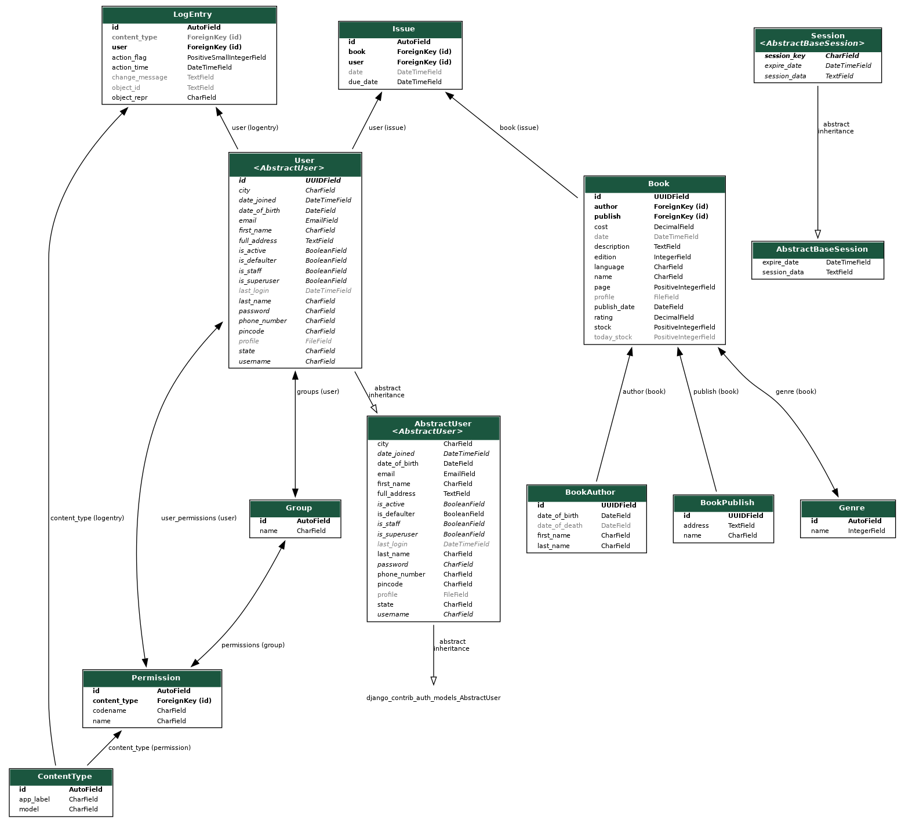

<h1 align="center" >Online Library Management System <a style="color: red;" href="https://www.github.com/shyamkumaryadav" target="_blank" >&copy;</a></h1>

     

### *About*
##### ```Dynamic Web Application & Bootstrap helps in responsive mobile web development. Perform DATABASE connectivity with PostgreSQL using Python.```

### *Use Me*
#####    ```python programming (Django)```
#####     ```PostgreSQL DATABASE (From Heroku)```
#####     ```HTML CSS JavaScript```
#####     ```BOOTSTRAP```
### *Detail*
     0. Member Signup -- New users can sign up
     1. Member Login -- Signed up users will login in
     2. View Books -- Anyone can view the books available
     3. Admin Login -- Admin will login
     4. Book Author Management -- Add/Update/Delete Author details
     5. Publisher Management -- Add/Update/Delete Publisher details
     6. Book Inventory -- Add/Update/Delete Book details
     7. Book Issuing Process -- Issue/Return Books

### My Model
[](Image_db/All_model.png)


#### *Live At*    [https://shyamkumaryadav.herokuapp.com/](https://shyamkumaryadav.herokuapp.com/)
